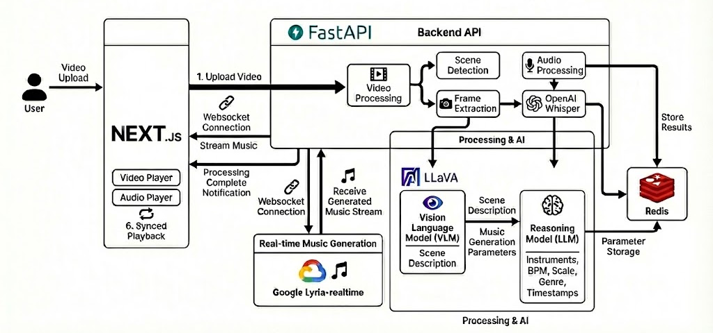

# 🎵 Timbre - Real-Time AI Music Generation for Videos
Create adaptive cinematic soundtracks powered by Google Lyria.

[](https://fastapi.tiangolo.com/)
[](https://nextjs.org/)
[](https://deepmind.google/models/lyria/lyria-realtime/)
[](https://www.docker.com/)
[](https://opensource.org/licenses/MIT)
[](http://makeapullrequest.com)

<div align="center">
    <p>
        🎬<a href="https://youtu.be/EbMrAt4xKwk">Watch Live Demo</a> • 
        🌐<a href="https://timbreapp.tech">Try it Now</a>
    </p>
</div>

---

## 🎼 What Is Timbre?

Timbre is a multimodal, adaptive scoring engine that creates real-time, context-aware music for your videos. By reading visual cues and spoken dialogue, Timbre identifies the exact vibe of every moment and uses Google Lyria to generate a perfectly synchronized soundtrack that evolves with your story.

---

## ✨ Key Features

- 🎵 **Real-time music generation** using Google Lyria's streaming API
- 📽️ **Automatic scene segmentation** (PySceneDetect + OpenCV)
- 🧠 **Multimodal LLM analysis** for mood, emotion, pacing
- ⚡ **Low-latency WebSocket audio streaming** with custom buffering layer
- 🛡️ **Fault-tolerant session manager** using Redis + resumable Lyria sessions

---

## 🏗️ System Overview




---

## ⚙️ How It Works

### **Analysis Phase**
1. **Video Upload** - Client sends video file via multipart upload
2. **Parallel Processing** - Concurrent frame extraction (OpenCV + PySceneDetect) and audio transcription
3. **LLM Musical Script** - AI analyzes visual/audio content to generate tempo, key, mood timeline
4. **Session Creation** - Redis stores analysis results and streaming configuration

### **Streaming Phase**
1. **WebSocket Connection** - Real-time bidirectional communication established
2. **Lyria Integration** - Google's RT API receives musical prompts and streams audio
3. **Dynamic Adaptation** - System adjusts musical parameters based on scene changes
4. **Seamless Delivery** - 2-second audio chunks with smooth crossfading

---

## 🧠 Engineering Challenges & Solutions

* **Inference Speed:** Switched to Groq and parallelized scene analysis because waiting for LLMs is boring.
* **Lyria Stability**: Engineered a custom heartbeat and reconnection system to keep the Google Lyria WebSocket alive during long sessions.
* **Audio Artifacts**: Wrote a crossfading algorithm to smooth out jarring "pops" between generated audio chunks.
* **Redis Latency**: Implemented pipelining and connection pooling to prevent bottlenecks during high-frequency state updates.
* **Error Recovery**: Added automatic retries and state migration so a single network blip doesn't crash the whole stream.

---

## 🛠️ Tech Stack

### **Backend**
- **FastAPI** - High-performance async API framework
- **Python 3.13** - Latest language features and performance
- **Redis** - Session state and real-time data management
- **PySceneDetect** - Intelligent video scene analysis
- **OpenCV** - Computer vision and frame processing
- **Google Lyria RT** - Real-time music generation
- **WebSockets** - Low-latency bidirectional communication

### **Frontend**
- **Next.js 14** - React framework with App Router
- **React 19** - Latest React features and concurrent rendering
- **AWS Amplify** - Authentication (Cognito) and deployment
- **Tailwind CSS** - Utility-first styling
- **Framer Motion** - Smooth animations and transitions
- **TypeScript** - Type-safe development

### **Infrastructure**
- **Docker Compose** - Containerized development environment
- **Turborepo** - Monorepo build system and caching
- **pnpm** - Fast, disk space efficient package manager

---

## 📁 Project Structure

```
timbre/
├── apps/
│   ├── backend/                # FastAPI application
│   │   ├── service/            # Core business logic
│   │   │   ├── auth/           # Authentication services
│   │   │   ├── global_eval/    # Video analysis engine
│   │   │   ├── lyria/          # Lyria API integration
│   │   │   └── video/          # Video processing utilities
│   │   ├── utils/              # Shared utilities
│   │   │   ├── audio/          # Audio processing
│   │   │   ├── video/          # Video manipulation
│   │   │   ├── llm/            # LLM integration & prompts
│   │   │   └── helper/         # Common utilities
│   │   ├── models/             # Data models
│   │   └── tests/              # Test suite
│   └── frontend/               # Next.js application
│       ├── src/app/            # App Router pages
│       ├── src/components/     # React components
│       └── src/lib/            # Frontend utilities
├── packages/                   # Shared packages
│   ├── eslint-config/          # Linting configuration
│   └── typescript-config/      # TypeScript settings
└── docker-compose.yml         # Development environment
```

---

## 🚀 Installation & Running Locally

### **Prerequisites**
- Docker & Docker Compose
- Node.js 18+ and pnpm
- Python 3.13+
- Google Cloud Project with Lyria API access

### **Quick Start**
```bash
# Clone the repository
git clone https://github.com/saat-sy/timbre.git
cd timbre

# Install dependencies
pnpm install

# Set up environment variables
cp apps/backend/.env.example apps/backend/.env
cp apps/frontend/.env.example apps/frontend/.env
# Configure your API keys and database URLs

# Start the development environment
docker-compose up -d

# Run the applications
pnpm dev
```

**🎉 That's it!** 
- Frontend: http://localhost:3000
- Backend API: http://localhost:8000
- API Docs: http://localhost:8000/docs

---

## 🗺️ Roadmap

- [ ] **Export mode** - Export an MP4 file with background music
- [ ] **Advanced scene detection** - More advanced emotion detection to understand the scene in depth
- [ ] **Multi-character emotional arcs** - Track and score individual character journeys

---

## 📄 License

This project is licensed under the MIT License - see the [LICENSE](LICENSE) file for details.

---

## 🤝 Contributing

Contributions are welcome! Please feel free to submit a Pull Request. For major changes, please open an issue first to discuss what you would like to change.

1. Fork the project
2. Create your feature branch (`git checkout -b feature/AmazingFeature`)
3. Commit your changes (`git commit -m 'Add some AmazingFeature'`)
4. Push to the branch (`git push origin feature/AmazingFeature`)
5. Open a Pull Request

---

## 📬 Contact & About Me

**Saatwik Yajaman** - MSCS Student at USC  
Building the future of AI-powered creative tools.

- 📧 Email: [yajaman@usc.edu](mailto:yajaman@usc.edu)
- 💼 LinkedIn: [linkedin.com/in/saatwik-yajaman](https://linkedin.com/in/saatwik-yajaman)
- 🐙 GitHub: [@saat-sy](https://github.com/saat-sy)

*Always excited to discuss AI, music technology, and creative engineering!*