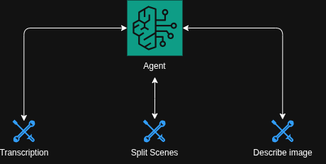

# Agent

The Timbre agent is an AI orchestration system that analyzes video content and generates structured audio prompts for soundtrack creation.



## Overview

Built with **AWS Bedrock** and the **Strands** framework, the agent uses a **ReAct pattern** (Reasoning and Acting) to coordinate multimodal video analysis. It intelligently combines scene detection, audio transcription, and visual analysis to understand video content and generate appropriate musical prompts.

## How It Works

The agent follows a **strategic four-stage workflow**:

1. **Scene Analysis** - Detects video structure, pacing, and natural boundaries
2. **Audio Analysis** - Transcribes speech for sentiment, pacing, and speaker dynamics  
3. **Visual Sampling** - Analyzes key frames at strategic moments
4. **Synthesis** - Combines all insights into 30-second audio generation prompts

## Tools

### Scene Extractor (`get_scene_list`)
- **Technology**: PySceneDetect with adaptive threshold detection
- **Purpose**: Understands video structure and identifies natural content divisions

### Transcriber (`transcribe`)
- **Technology**: AssemblyAI API with speaker detection and S3 caching
- **Purpose**: Extracts emotional sentiment and dialogue pacing patterns

### Image Descriptor (`describe_image`)
- **Technology**: AWS Bedrock Nova Pro vision capabilities
- **Purpose**: Analyzes visual mood, lighting, and atmosphere at key moments

## Output

Generates structured JSON for downstream audio generation:

```json
[
  {
    "start": 0.0,
    "end": 30.0, 
    "prompt": "Upbeat electronic music with driving beat...",
    "reasoning": "Scene analysis shows rapid cuts, transcription reveals excited dialogue, visuals confirm dynamic movement"
  }
]
```

## Project Structure

```
apps/agent/
├── agent.py              # Main orchestration logic
├── tools/                # Analysis tools
│   ├── transcribe.py     # Audio transcription
│   ├── describe_image.py # Visual frame analysis
│   └── scene_extractor.py# Scene boundary detection
└── utils/               # Supporting utilities
    ├── prompts.py       # System prompts and workflow logic
    └── utils.py         # Validation helpers
```