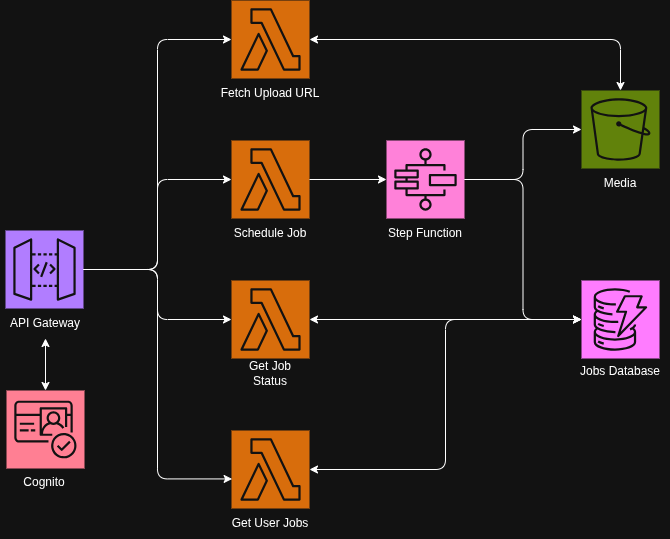
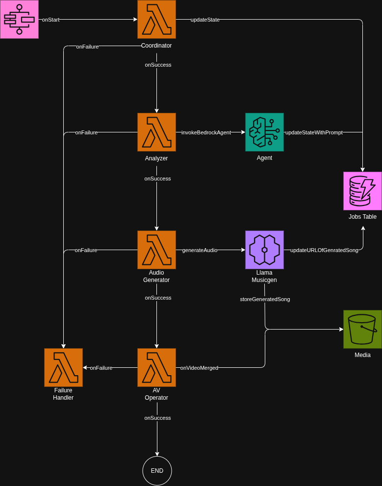

# Backend Architecture

Serverless video-to-music pipeline on AWS using Step Functions orchestration and Lambda microservices.



## Overview

**Tech Stack**: Python 3.13 Lambdas, Step Functions, Cognito, S3, DynamoDB, API Gateway, AWS SAM

## API Layer

Four REST endpoints handle client interactions:

- **create_upload_url** - Generates S3 presigned URLs for video uploads with AES256 encryption
- **submit_job** - Pipeline initiation and regeneration requests with UUID validation
- **get_job_status** - Real-time job status queries with user authorization
- **get_user_jobs** - User job history retrieval with pagination support

All endpoints use **Cognito JWT authorization** and **CORS-enabled** API Gateway with proper preflight handling.

## Step Functions Pipeline

The core processing orchestrated by AWS Step Functions:



### Component Details

#### Coordinator
- **Role**: Workflow orchestration and job summary generation
- **Operations**: 
  - Transitions jobs between pipeline stages
  - Generates content summaries using Claude-3.5-Sonnet

#### Analyzer
- **Role**: Video content analysis via Bedrock Agent
- **Operations**:
  - Invokes multimodal agent with video and user prompt
  - Handles regeneration requests with session continuity
  - Extracts structured audio prompts from agent response
- **Output**: JSON plan with temporal audio segments

#### Audio Generator
- **Role**: Parallel music synthesis from analysis prompts
- **Operations**:
  - Submits concurrent requests to SageMaker MusicGen endpoint
  - Polls for completion and retrieves generated audio files
  - Links audio files to corresponding video segments
- **Output**: Final generated audio

#### AV Operator
- **Role**: Audio-video composition using FFmpeg
- **Operations**:
  - Downloads video and generated audio files
  - Applies volume balancing, fades, and temporal synchronization
  - Mixes audio segments with original video audio
- **Output**: Final composed video with soundtrack

#### Failure Handler
- **Role**: Error capture and graceful failure management
- **Operations**:
  - Captures pipeline errors with detailed context
  - Ensures jobs are marked as failed for user visibility

### Error Handling
- **Global Catch**: All stages route failures to Failure Handler
- **State Persistence**: Job status updates at each transition
- **Retry Logic**: Built-in exponential backoff for transient failures
- **Rollback**: Automatic cleanup of partial processing results

## Data Architecture

### Job Entity
```python
job_id: str           # UUID primary key
user_id: str          # Cognito sub claim  
s3_url: str           # Video location
prompts: List[str]    # User prompts (regeneration history)
status: str           # SCHEDULED|PROCESSING|COMPLETED|FAILED
operation_type: str   # NEW|REGENERATE
final_url: str        # Output video S3 path
```

## Infrastructure

### Layers
- **SharedCode**: Models, constants, utilities
- **FFmpeg**: Media processing binaries

### Security  
- **IAM**: Least-privilege execution roles
- **S3**: Bucket policies for presigned URL scope
- **Cognito**: JWT validation on protected endpoints

## Project Structure

```
src/
├── lambdas/
│   ├── api/                    # REST endpoint handlers
│   └── steps/                  # State machine tasks
├── layers/
│   ├── shared_code/python/     # Common utilities
│   └── ffmpeg_layer/bin/       # Media processing binaries
└── state_machine/
    └── workflow.asl.json       # Step Functions definition
```